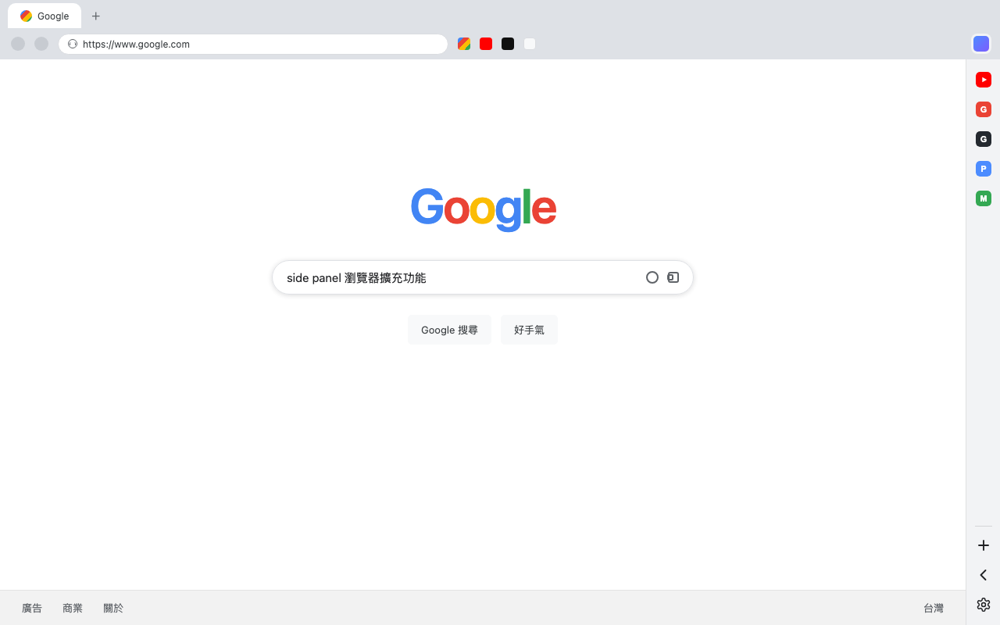

# Sidebarr — 瀏覽器側邊欄工具

一個讓網頁「長」出原生風側邊欄的 Chromium 擴展。右緣常駐 44px 面板列（rail），完全不遮蓋網頁內容，並可展開為完整的側邊欄，在瀏覽器內瀏覽任何網站。



## 功能特色

- **雙軌架構（Dual Rail）**：側邊欄開啟時，rail 在面板右緣；關閉時，網頁內容自動往左讓出 44px，rail 停靠成原生瀏覽器般的停靠欄——**永不遮住網頁內容，永不消失**
- **側邊欄內嵌網頁**：點擊 rail 上的網站圖示，在原生側邊欄中開啟網站（透過 `declarativeNetRequest` 動態規則移除 X-Frame-Options / CSP 限制）
- **快速加入**：點擊 `+` 把目前分頁加入面板列
- **一鍵 Google 搜尋**：點擊 `<` 立即在側邊欄開啟 Google
- **拖曳排序**：按住網站圖示拖曳即可調整順序
- **右鍵移除**：在圖示上按右鍵移出面板列
- **主題與自訂顏色**：自動（跟隨瀏覽器）/ 淺色 / 深色 / 自訂色

## 安裝方式（開發者模式）

1. 下載本倉庫（Code → Download ZIP）並解壓縮
2. 開啟瀏覽器的擴展管理頁：
   - Brave：`brave://extensions`
   - Chrome：`chrome://extensions`
   - Edge：`edge://extensions`
3. 開啟右上角「開發者模式」
4. 點「載入未封裝項目」，選擇解壓縮後的資料夾

## 相容性

| 瀏覽器 | 狀態 |
|---|---|
| Brave / Chrome / Edge | ✅ 完整支援 |
| Opera / Vivaldi / Arc 等 Chromium | ✅ 應可運作 |
| Firefox | ❌ 不支援（使用 WebExtension 側邊欄 API） |

版本需求：`chrome.sidePanel.close()` 需 Chrome 141+；`chrome.sidePanel.onClosed` 需 Chrome 142+（不支援時自動降級，不影響功能）。

## 使用說明

- **側邊欄關閉時**：網頁右側讓出 44px 停靠欄，點圖示開啟側邊欄
- **側邊欄開啟時**：點 `X` 或 `<` 收合，回到停靠欄狀態
- **加入網站**：瀏覽目標網站 → 點 `+`
- **移除網站**：圖示上按右鍵
- **調整順序**：拖曳圖示
- **設定**：點齒輪可切換主題、自訂面板顏色

## Permissions

| Permission | Purpose |
|---|---|
| `sidePanel` | Display websites in the browser's native side panel |
| `declarativeNetRequest` | Static/dynamic rules that strip X-Frame-Options and CSP headers so websites can be embedded in the side panel |
| `storage` | Store the site list, order, and theme settings (local only) |
| `tabs` | Read the current tab's URL/title to add it to the rail |
| `scripting` | Inject the rail into the page when the side panel is closed |

This extension **does not collect or upload any user data**. Everything is stored locally on your device.

## 開發

```
brave-sidebar/
├── manifest.json      # 擴展設定（v3）
├── background.js      # 側邊欄開關、規則管理、動態注入
├── content.js/css     # 頁面停靠欄（rail）
├── sidepanel.js/html/css # 側邊欄內 UI
├── rules.json         # 靜態 DNR 規則
└── icons/             # 擴展圖示
```

重新載入：修改後至擴展管理頁點「重新載入」，已開啟的分頁需重新整理一次。

## 授權

[MIT](LICENSE)
